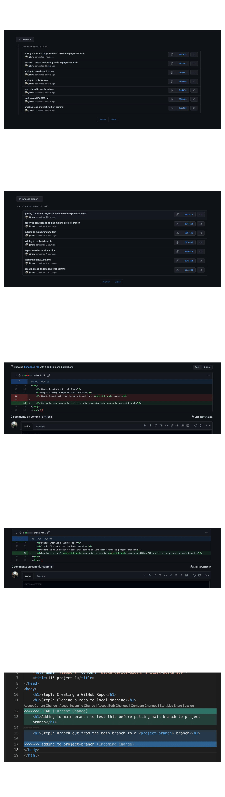

# Assignment Content

## This assignment will make you understand better the workflow of git and GitHub.

```
this assignment, you will need to create a repo on GitHub,
make branches, merge main into branches and then pull it to the main branch.

You can make any repo, and it could be one of the other classes
assignment you work on, or it could be just a meme repo. What is essential is the commits. I want to see a lot of commits, at least ten, including merge commits and regular commits.

```

### How to finish the assignment

```
1. Create a repo on GitHub, make it public
2. Clone it to your local machine
3. Branch out from the main branch to a <feature> branch
4. Add, commit and push your work
5. When you are doing work on the <feature>, pull the main branch into the <feature> branch
6. Push the local <feature> branch to the remote <feature> branch on GitHub
7. Pull the <feature> branch into the main branch
8. Paste the link to the repo in the submission.

```

```
Make sure you have a lot of commits and merge commits. I would like to see them as well you will get marked on it.

The more commit messages, the better you can do more than one branch and merge it all to the main.

What I wouldn't like to see -

no branches
One commit
no content in the repo

```

### Status : in progress

### Solution


